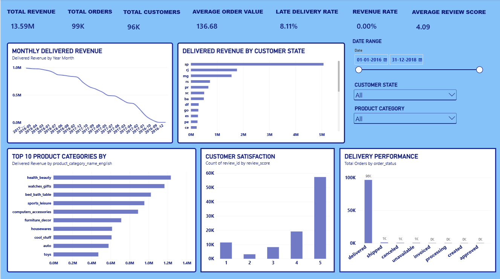
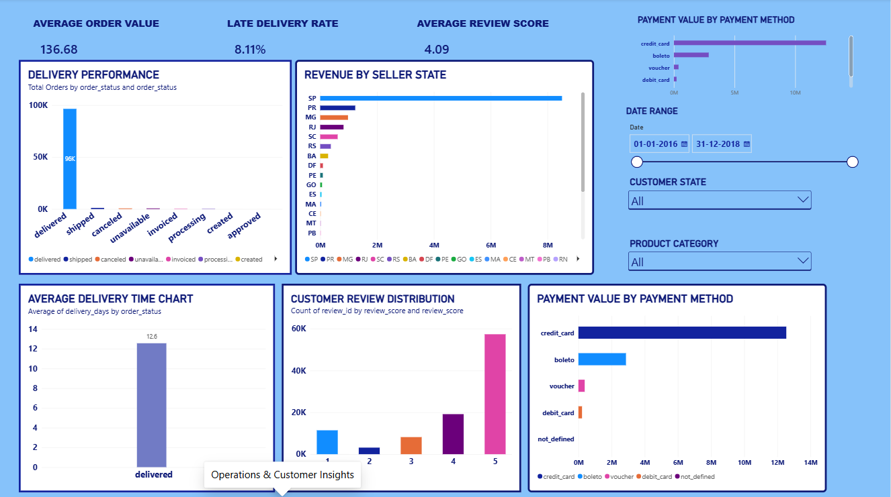

# Enterprise Customer & Revenue Intelligence Platform

An end-to-end data analytics and business intelligence project that transforms raw e-commerce data into actionable insights using Python, SQL, MySQL, and Power BI.

---

## 📊 Project Overview

This project analyzes the **Olist Brazilian E-Commerce Public Dataset** to understand business performance across:

- Revenue
- Customers
- Products and categories
- Sellers
- Orders
- Delivery operations
- Payments
- Customer satisfaction

The project follows an end-to-end analytics workflow:

**Raw Data → Python ETL → MySQL → SQL Analysis → Power BI → Business Insights**

The objective is to demonstrate how a Data Analyst can transform raw transactional data into business-ready insights and decision-making dashboards.

---

## 🎯 Business Objective

The main objective is to identify actionable insights that can support:

- Revenue growth
- Customer retention
- Customer segmentation
- Product and category optimization
- Seller performance monitoring
- Delivery performance improvement
- Customer satisfaction analysis
- Operational decision-making

---

## 🛠️ Technology Stack

| Area | Technologies |
|---|---|
| Programming | Python |
| Data Processing | Pandas, NumPy |
| Database | MySQL |
| SQL | MySQL, CTEs, Window Functions, Aggregations |
| Business Intelligence | Power BI |
| Data Visualization | Power BI |
| Analytics | DAX, Power Query |
| Development | VS Code, Jupyter Notebook |
| Version Control | Git, GitHub |

---

## 🏗️ Architecture

```text
Olist E-Commerce Dataset
          ↓
     Data Profiling
          ↓
      Python ETL
          ↓
   Cleaned CSV Data
          ↓
        MySQL
          ↓
     SQL Analysis
          ↓
      Power BI
          ↓
 Interactive Dashboards
          ↓
 Business Insights
```

---

## 📂 Project Structure

```text
Enterprise-Customer-Revenue-Analytics/
│
├── data/
│   ├── raw/
│   └── processed/
│
├── notebooks/
│   └── 01_data_profiling.ipynb
│
├── reports/
│   └── business_insights.md
│
├── sql/
│   └── 01_business_analysis.sql
│
├── src/
│   ├── data_cleaning/
│   ├── data_ingestion/
│   ├── analysis/
│   └── database/
│
├── powerbi/
│
├── tests/
│
├── .gitignore
├── requirements.txt
└── README.md
```

---

## 🔄 Data Pipeline

### 1. Data Profiling

The raw datasets were profiled using Python and Pandas to understand data quality and structure.

The profiling process examined:

- Dataset dimensions
- Missing values
- Duplicate records
- Data types
- Order status distribution
- Delivery-date completeness
- Review-data completeness

---

### 2. Data Cleaning & ETL

Python was used to prepare the datasets for analytical processing.

The ETL process included:

- Cleaning and standardizing data
- Handling missing values
- Converting date fields
- Creating analytical features
- Preparing cleaned datasets for database loading

---

### 3. Database

The cleaned datasets were loaded into a relational MySQL database called:

```text
enterprise_analytics
```

The main tables include:

- Customers
- Orders
- Order Items
- Payments
- Reviews
- Products
- Sellers

The database uses relationships between customers, orders, products, sellers, payments, and reviews to support analytical queries.

---

### 4. SQL Business Analysis

SQL was used to answer key business questions related to:

- Revenue performance
- Monthly revenue trends
- Average order value
- Customer retention
- Customer segmentation
- Revenue concentration
- Product performance
- Category performance
- Seller performance
- Delivery performance
- Customer satisfaction
- Payment methods

Advanced SQL techniques used include:

- JOINs
- GROUP BY
- Aggregations
- CASE statements
- Common Table Expressions (CTEs)
- Window functions
- Customer segmentation
- Ranking
- Conditional aggregation

---

### 5. Power BI

Power BI was used to transform the analyzed data into interactive business dashboards.

The dashboards include:

- KPI cards
- Revenue trends
- Order trends
- Product category analysis
- Geographic analysis
- Delivery metrics
- Customer satisfaction
- Seller analysis
- Payment analysis
- Interactive slicers and filters

---

# 📈 Power BI Dashboard

## Executive Overview

The Executive Overview dashboard provides a high-level view of overall business performance.

### Key KPIs

- Total Revenue
- Total Orders
- Total Customers
- Average Order Value
- Late Delivery Rate
- Average Review Score
- Revenue Growth

### Dashboard Preview



### Visualizations

- Monthly Revenue Trend
- Monthly Order Volume
- Top 10 Product Categories by Revenue
- Revenue by Customer State

### Interactive Filters

- Date Range
- Customer State
- Product Category

---

## Operations & Customer Insights

The second dashboard focuses on operational performance and customer behavior.

### Key Metrics

- Average Order Value
- Late Delivery Rate
- Average Review Score
- Average Delivery Time

### Visualizations

- Delivery Performance
- Order Status Distribution
- Customer Review Distribution
- Revenue by Seller State
- Payment Value by Payment Method

### Interactive Filters

- Date Range
- Customer State
- Product Category

---

# 💡 Key Business Insights

## Revenue Performance
- Total product revenue: 13221498.11
- Total freight value: 2198275.64
- Total orders: 96478
- Average order value: 137.04
- November 2017 was the highest-revenue month, generating approximately **987,765.37** in product revenue.
- December 2016 represented a very low-revenue period, with approximately **10.90** in product revenue.
- Revenue performance varies considerably across months, indicating significant changes in transaction activity over time.

---

## Customer Insights

Customer behavior shows a strong concentration of one-time purchasers.

- Approximately **93,358 customers** were associated with delivered orders.
- Approximately **2,801 customers** were repeat customers.
- The repeat customer rate was approximately **3.00%**.
- The majority of customers therefore made only a single purchase.

Customer segmentation identified:

- **Low Value:** 89,724 customers
- **Medium Value:** 2,693 customers
- **High Value:** 941 customers

A relatively small group of customers contributes a significant proportion of total revenue.

The top 20% of customers generated approximately **56.62% of total revenue**.

This indicates an opportunity to improve customer retention while protecting and engaging high-value customers.

---

## Delivery & Operational Performance

Delivery performance was analyzed using order purchase dates, delivery dates, and estimated delivery dates.

Key findings include:

- Average delivery time: approximately **12.56 days**
- Average delivery delay: approximately **-11.18 days**
- Delivered orders: **96,478**
- Late orders: **7,826**
- Late delivery rate: approximately **8.11%**

The negative average delivery delay indicates that orders were delivered earlier than their estimated delivery dates on average.

However, a smaller group of orders experienced significant delays and requires operational attention.

---

## Customer Satisfaction

Customer reviews were analyzed to understand overall satisfaction and the relationship between delivery performance and customer experience.

Key findings:

- Total reviews: **99,224**
- Average review score: approximately **4.09 / 5**

### Review Distribution

| Review Score | Number of Reviews |
|---:|---:|
| 1 Star | 11,424 |
| 2 Stars | 3,151 |
| 3 Stars | 8,179 |
| 4 Stars | 19,142 |
| 5 Stars | 57,328 |

Delivery performance has a strong relationship with customer satisfaction.

- Late-delivery orders had an average review score of approximately **2.57**
- On-time or early orders had an average review score of approximately **4.29**

This suggests that improving delivery reliability can have a significant positive impact on customer satisfaction.

---

## 🛍️ Product & Category Performance

The analysis identified the highest-performing product categories by revenue.

### Top Product Categories

| Category | Revenue |
|---|---:|
| Health & Beauty | 1,233,131.72 |
| Watches & Gifts | 1,166,176.98 |
| Bed/Bath/Table | 1,023,434.76 |
| Sports & Leisure | 954,852.55 |
| Computers & Accessories | 888,724.61 |

The highest-revenue individual product generated approximately **63,560.00** in product revenue.

The analysis also identified categories with relatively low customer satisfaction despite meaningful revenue contribution.

For example:

- Office Furniture generated approximately **266,533.43** in revenue with an average review score of **3.52**.
- Bed/Bath/Table generated over **1 million** in revenue with an average review score of approximately **3.92**.
- Furniture Decor generated approximately **712,414.53** in revenue with an average review score of approximately **3.95**.

These categories represent opportunities for deeper product-level and operational investigation.

---

## 🏪 Seller Performance

Seller performance was analyzed using order volume, revenue, and delivery performance.

The highest-performing seller recorded:

- **1,124 orders**
- Approximately **226,987.93** in revenue
- Seller state: **SP**

The analysis also identified several sellers with late-delivery rates above **20%**.

These sellers represent potential operational-risk areas and could be investigated further to identify:

- Logistics problems
- Processing delays
- Regional delivery issues
- Inventory constraints
- Carrier performance issues

---

# 📊 Business Recommendations

## 1. Improve Customer Retention

The relatively low repeat customer rate indicates an opportunity to increase customer lifetime value.

Recommended actions:

- Introduce personalized offers
- Develop loyalty programs
- Use purchase history for targeted campaigns
- Identify customers at risk of becoming inactive

---

## 2. Protect High-Value Customers

A relatively small percentage of customers contributes a significant share of revenue.

Recommended actions:

- Create VIP customer programs
- Provide personalized recommendations
- Offer targeted promotions
- Monitor high-value customer satisfaction

---

## 3. Improve Delivery Performance

Late delivery is strongly associated with lower customer satisfaction.

Recommended actions:

- Monitor high-risk sellers
- Identify recurring delivery bottlenecks
- Track seller-level late-delivery rates
- Investigate regional logistics issues
- Develop seller performance thresholds

---

## 4. Monitor Customer Satisfaction

Customer review scores should be monitored alongside operational metrics.

Recommended actions:

- Track review scores by seller
- Track review scores by product category
- Investigate categories with low satisfaction
- Analyze the relationship between delivery delays and reviews

---

## 5. Optimize Product Categories

Revenue and customer satisfaction should be analyzed together rather than independently.

Recommended actions:

- Prioritize high-revenue categories
- Investigate high-revenue/low-satisfaction categories
- Identify products with strong revenue and high ratings
- Review underperforming product categories

---

# 📁 Dataset

This project uses the **Olist Brazilian E-Commerce Public Dataset**.

The dataset contains information related to:

- Customers
- Orders
- Order items
- Payments
- Reviews
- Products
- Sellers
- Product categories
- Geographic information

The raw and processed CSV datasets are intentionally excluded from the GitHub repository because of their size.

The project includes the data profiling, ETL, SQL analysis, and database-loading workflow required to reproduce the analytical pipeline.

---

# 🚀 How to Run

## 1. Clone the Repository

```bash
git clone <YOUR_GITHUB_REPOSITORY_URL>
cd Enterprise-Customer-Revenue-Analytics
```

---

## 2. Create a Virtual Environment

```bash
python -m venv .venv
```

---

## 3. Activate the Virtual Environment

On Windows:

```powershell
.venv\Scripts\activate
```

---

## 4. Install Dependencies

```bash
pip install -r requirements.txt
```

---

## 5. Configure the Database

Create a `.env` file in the project root:

```text
DB_HOST=localhost
DB_PORT=3306
DB_USER=root
DB_PASSWORD=your_password
DB_NAME=enterprise_analytics
```

Do not commit the `.env` file to GitHub.

---

## 6. Run the Data Cleaning Pipeline

```bash
python src/data_cleaning/clean_data.py
```

This processes the raw datasets and generates cleaned datasets for database loading.

---

## 7. Load Data into MySQL

```bash
python src/database/load_to_mysql.py
```

The cleaned data is loaded into the `enterprise_analytics` MySQL database.

---

## 8. Run SQL Analysis

Open the SQL scripts located in:

```text
sql/
```

and execute them in MySQL/phpMyAdmin.

---

## 9. Open the Power BI Dashboard

Open the Power BI report and connect it to the:

```text
enterprise_analytics
```

MySQL database.

---

# 📋 Business Insights Report

A detailed business insights report is available in:

```text
reports/business_insights.md
```

The report documents:

- Revenue findings
- Customer insights
- Delivery performance
- Customer satisfaction
- Product and category performance
- Seller performance
- Strategic recommendations

---

# 👩‍💻 Skills Demonstrated

### Data Analytics

- Exploratory Data Analysis
- Data Cleaning
- Data Transformation
- Business Analysis
- Customer Analytics
- Revenue Analytics
- Operational Analytics

### Programming

- Python
- Pandas
- NumPy

### Database & SQL

- MySQL
- Relational Data Modeling
- SQL JOINs
- Aggregations
- CTEs
- Window Functions
- Conditional Logic
- Customer Segmentation

### Business Intelligence

- Power BI
- DAX
- Power Query
- KPI Development
- Interactive Dashboards
- Data Visualization

### Engineering & Tools

- ETL Pipelines
- Git
- GitHub
- VS Code
- Jupyter Notebook

---

# 🎯 Project Outcome

This project demonstrates an end-to-end analytics workflow starting from raw transactional data and progressing through:

**Data Profiling → Data Cleaning → ETL → Database Engineering → SQL Analysis → Business Intelligence → Strategic Recommendations**

The resulting platform provides both technical analytics capabilities and business-focused insights that can support data-driven decision-making.